This month I taught the children how to make different kinds of sennet braids with strips of fabric. It was great to see them enjoying the challenge and experimenting with different colours. They even started braiding each other’s hair! Many of the kids seem to really enjoy these fabric activities and they said look forward to it every week.

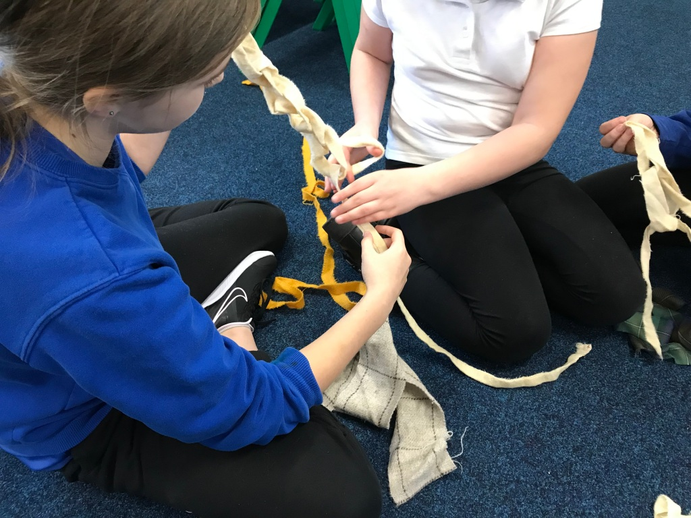

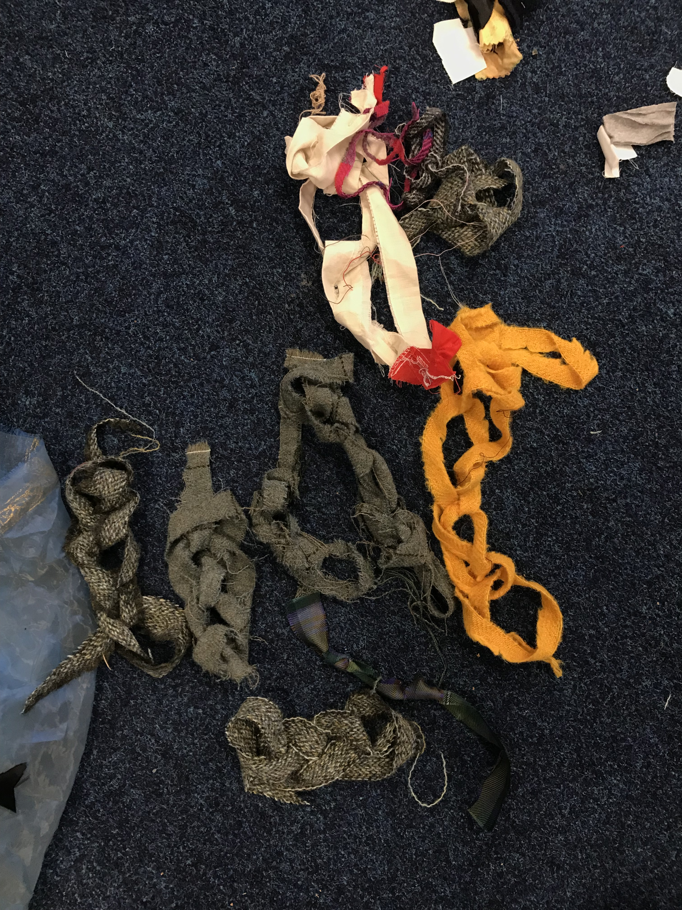

We also smocked fabric which was good for their sewing skills. They found it quite fiddly and challenging but they were pleased to see the finished result. It looked beautifully organic!

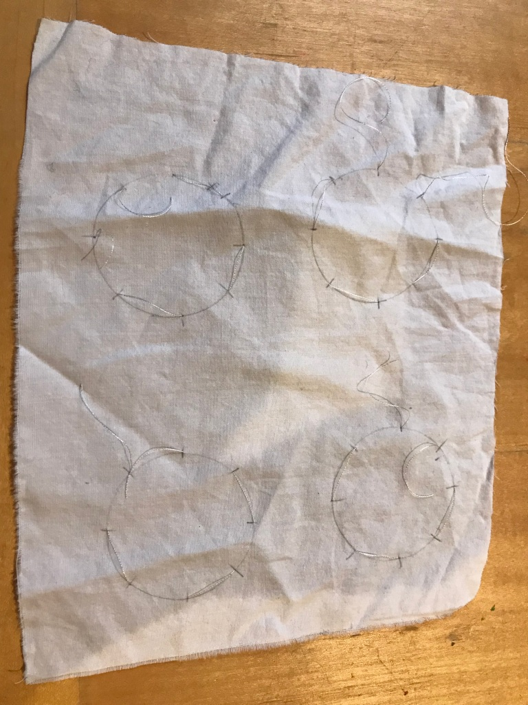

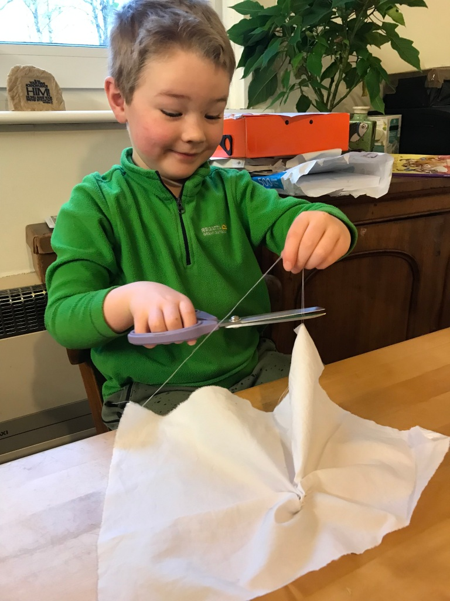

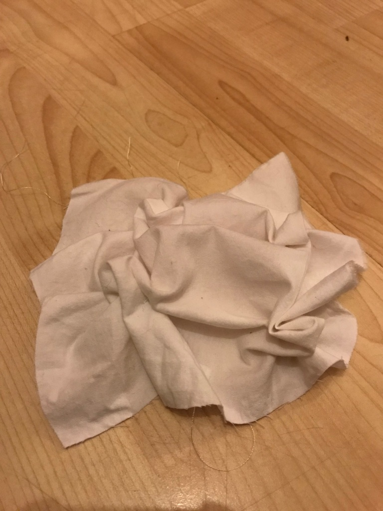

When the weather wasn’t so wild we went outside and used pieces of string to see what different shapes we could make. Inspired by what I’d learnt from a performance session led by Molly Danter, I started by inviting the children to hold the very end of the string each with a partner. The challenge is to keep the string straight without pulling it out of their partner’s grasp. It’s interesting to see how pulling the string can allow one person to lead their partner’s movement and whether they want to follow the pull of the string or how an imbalance can cause them to drop the string or let it go slack. Then they gradually got more confident with keeping the string straight together and I showed them things they could do such as twirling under the string (one at a time, then together) then stepping over the sting; the whole time taking on the challenge to keep it straight, for some it took a bit of practice! 

It was wonderful to see how they took my suggestions and then really made it their own. Some children even made themselves into a train formation, one behind the other, connected by the string. They also made many different shapes on the ground and they added their strings together to make one collaborative image; interpreting it in their own unique ways. It was great to see them having fun and using their imagination to create so much with only a few bits of string!

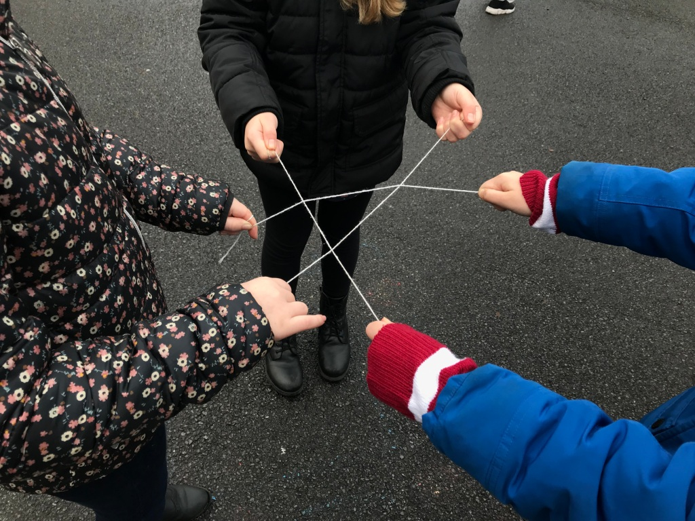

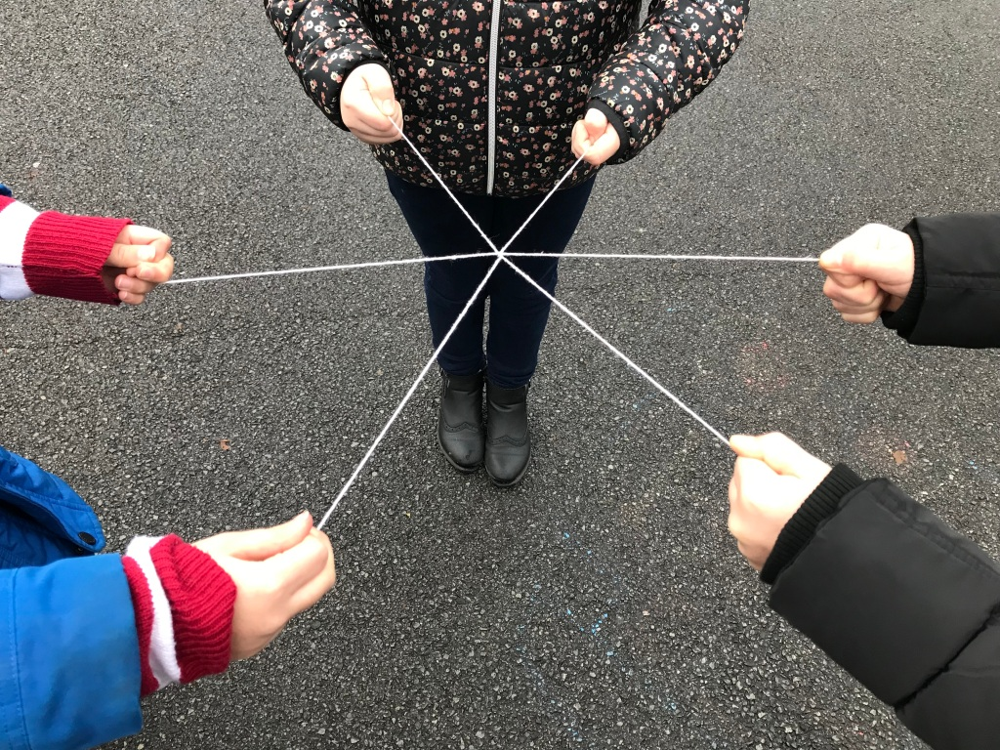

I took some children on a bird hunt. We quietly and carefully searched around and found some sparrows singing. I invited them to imitate the sound by whistling. We also heard crows squawking. They had fun! We made some bird pictures out of leaves as well.

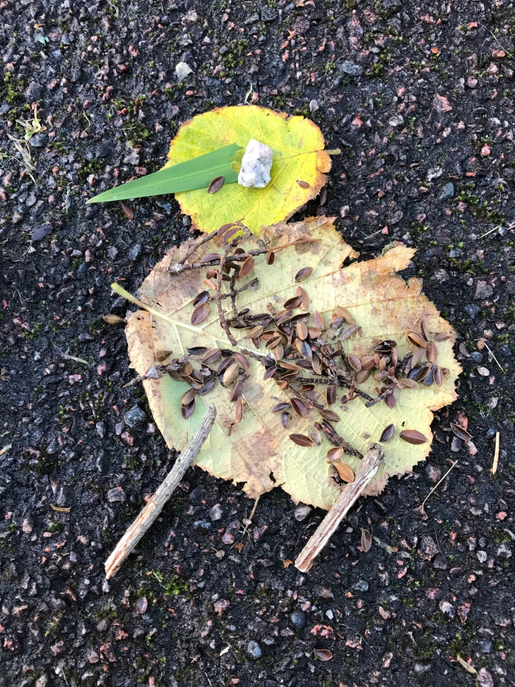

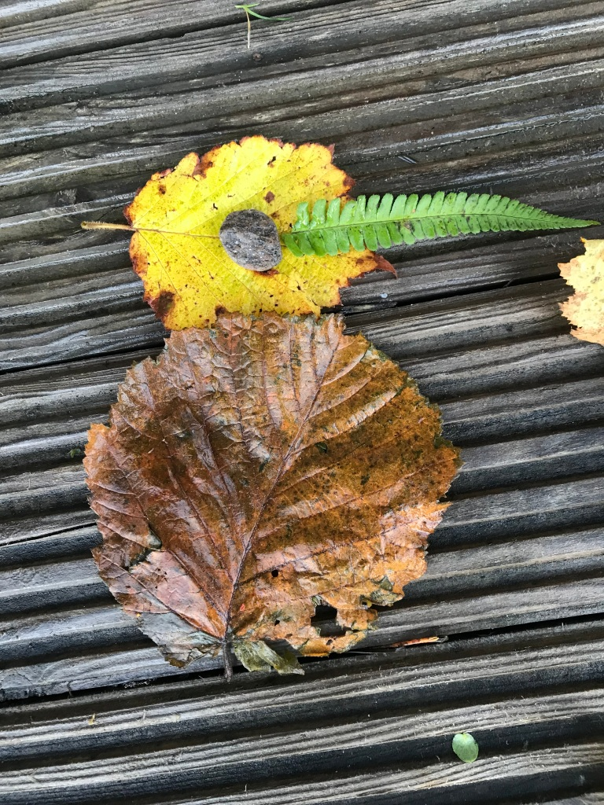

At Auchtertyre Primary, we went into the forest in their playground and found sticks to make little towers! It was difficult to get some sticks to balance; we found that the thicker the sticks were, the more they would roll around so we found thinner ones. Some towers toppled over but the children were determined to build them back up. One girl made a tower higher than I could make mine! I was so impressed! They enjoyed the challenge and even though it was frustrating when the towers fell down.

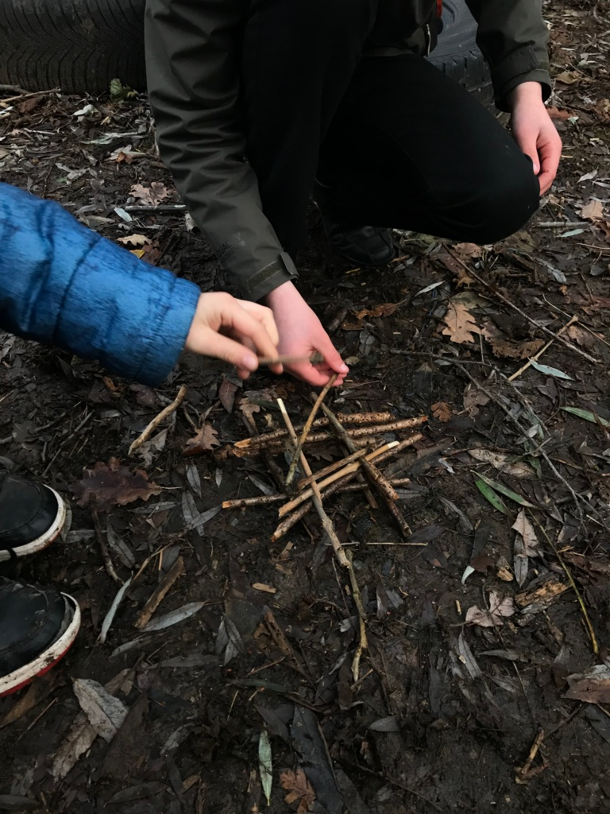

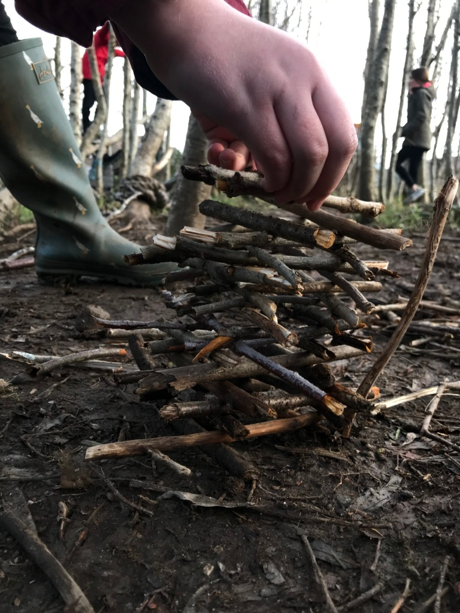

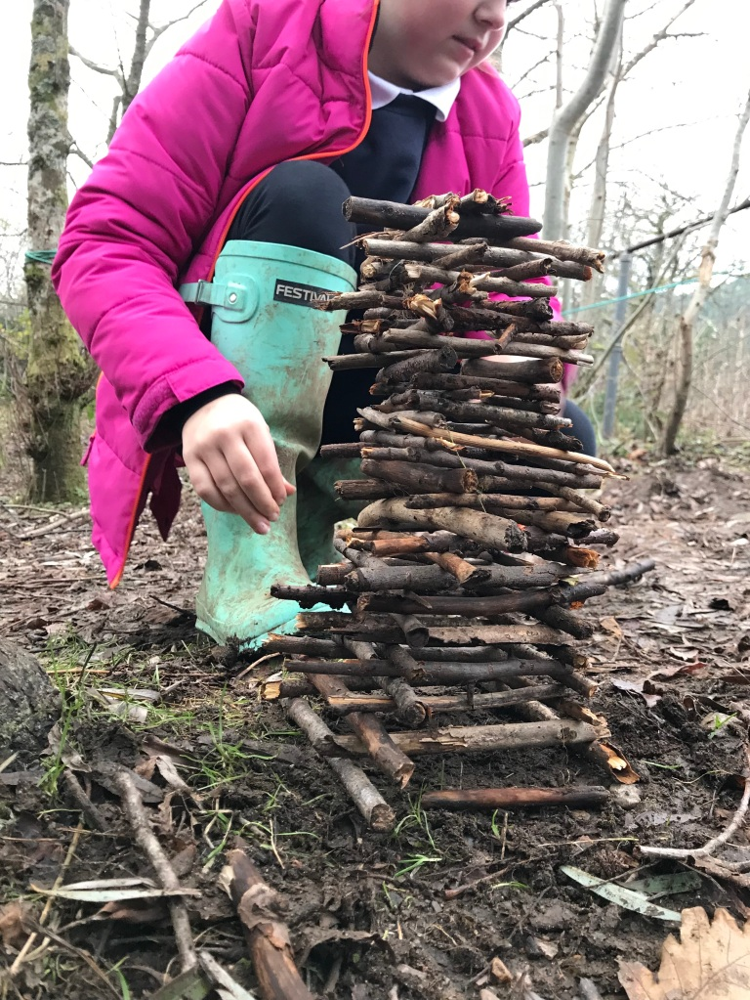

With the children at Loch Duich Primary we made sculptures and pictures on the beach. One girl made a beautiful mermaid.

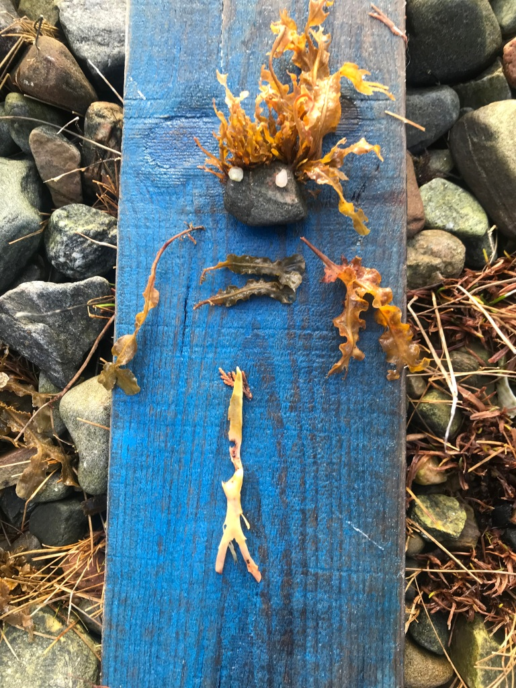

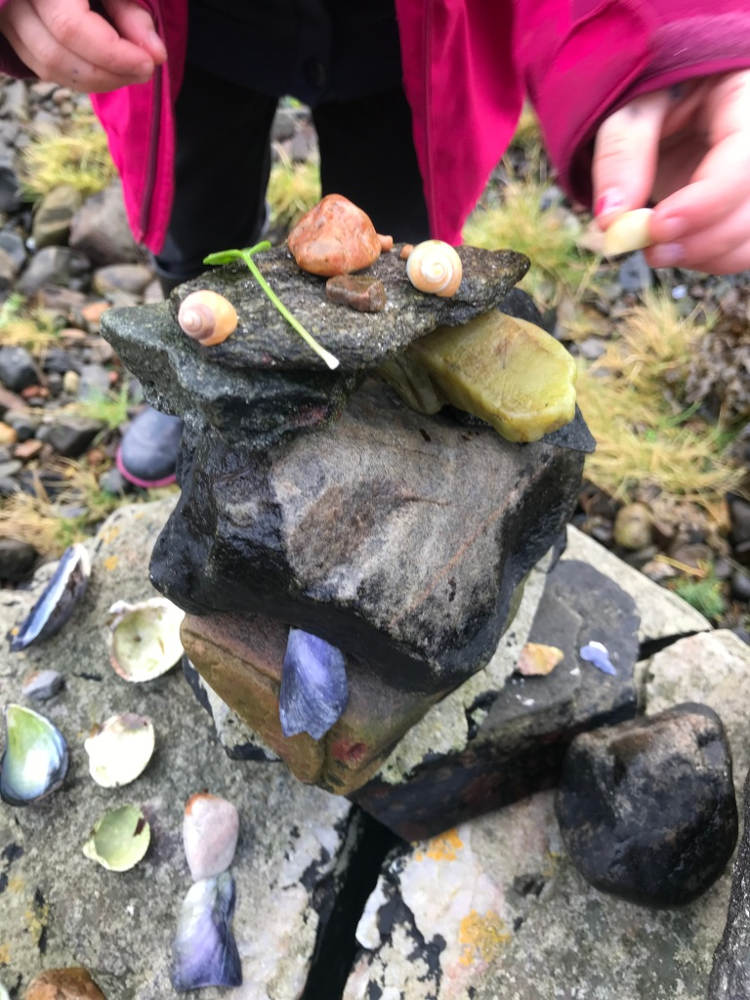
