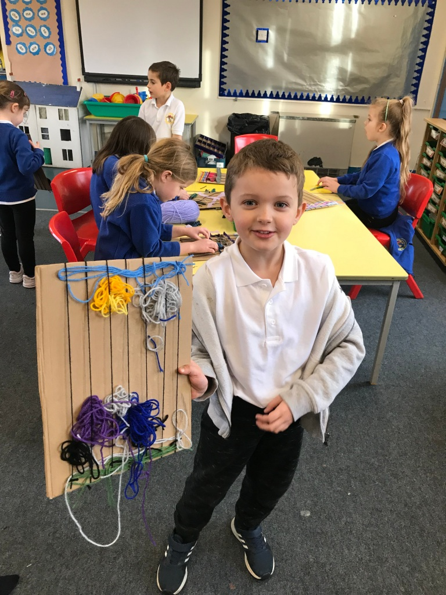
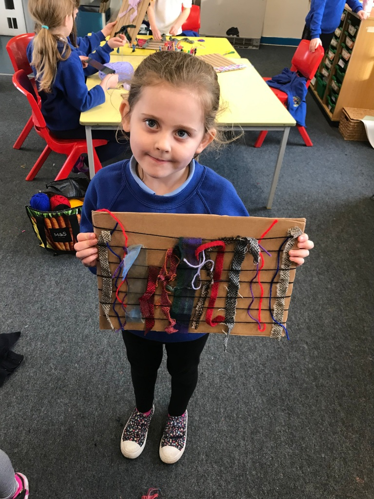
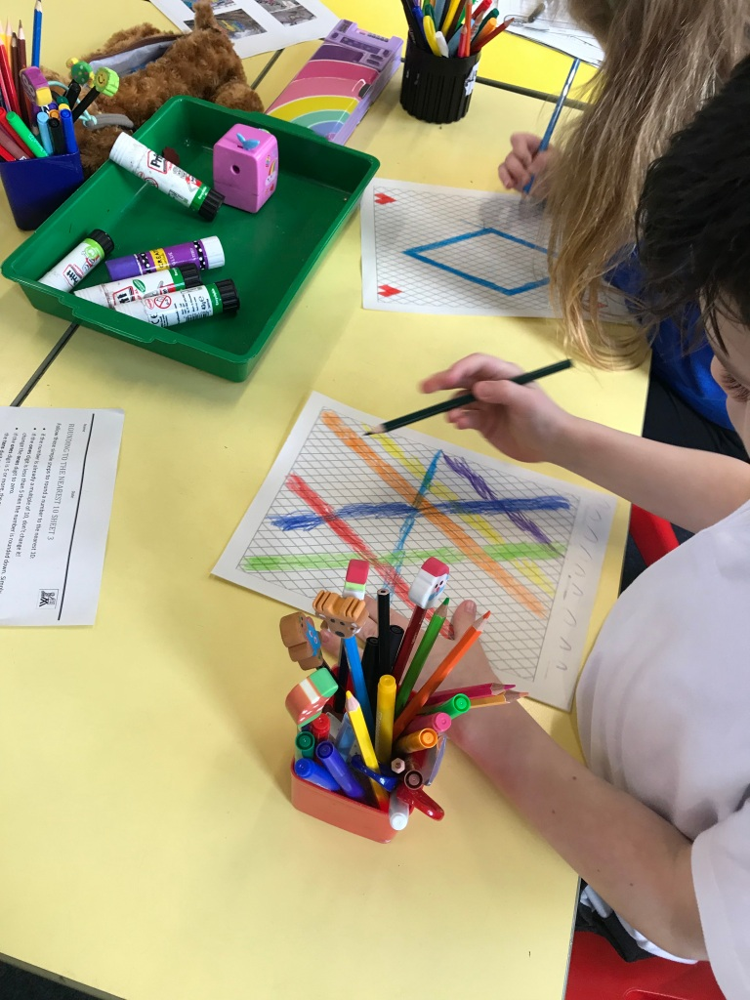
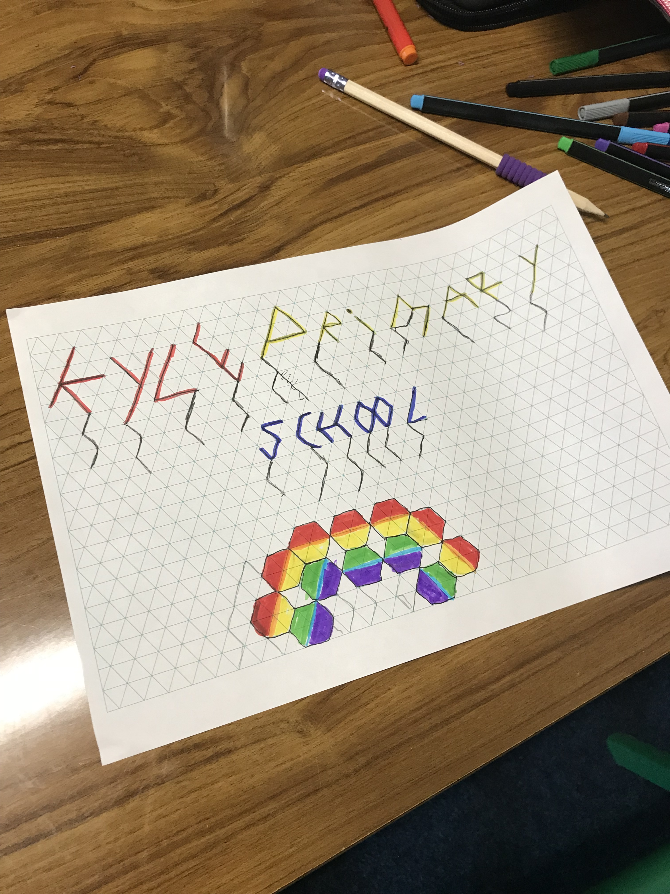
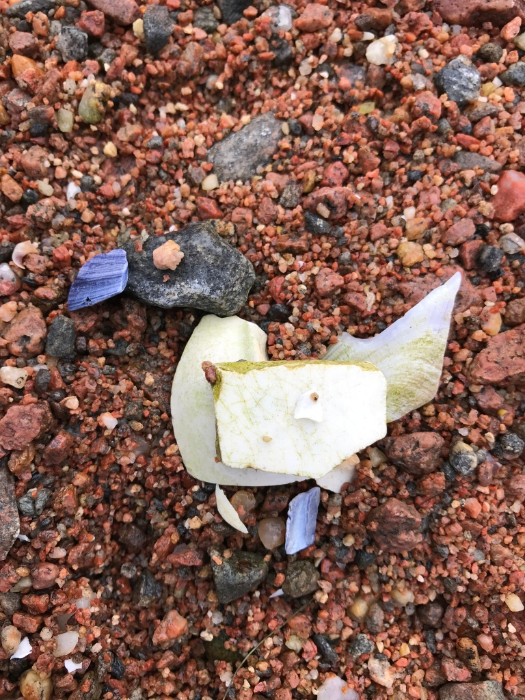
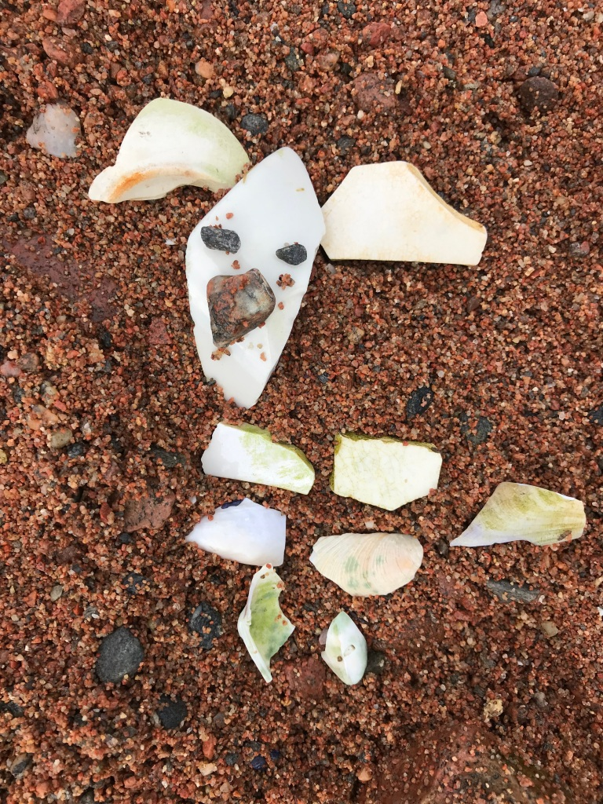
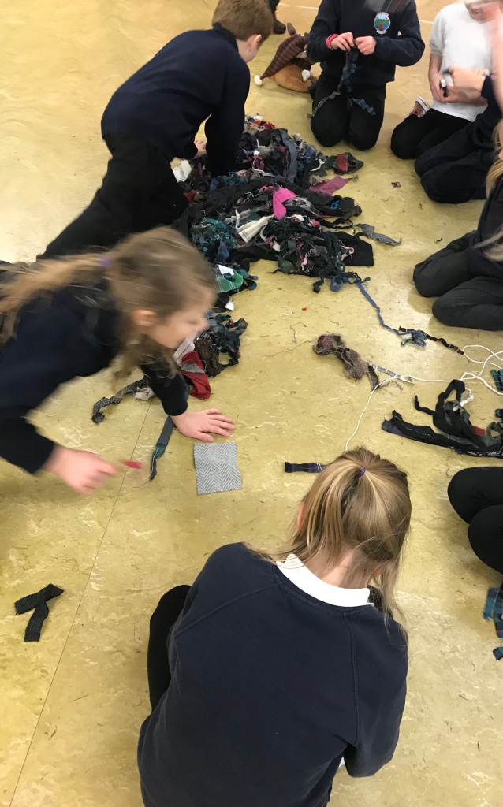
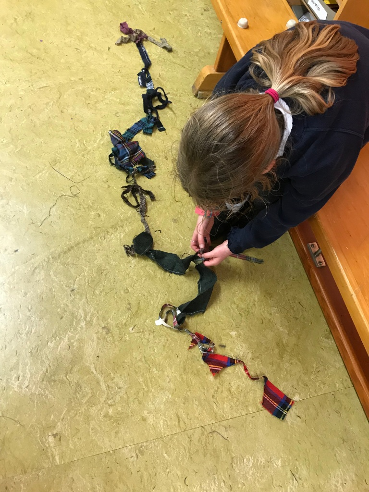

At Kyle Primary we practiced doing some weaving and they came up with some very unique creations out-with the bounds of traditional weaving! I also did weaving with the home schooled family.

At Kyle Primary we also made designs on diamond-patterned paper in preparation for decorating the playground fence with fabric.

With the home schooled girl and her brother, we made images on the shore with anything we could find; they made some really detailed, beautiful characters!

At Loch Duich Primary we made fabric scrap creations which they found very exciting! 

