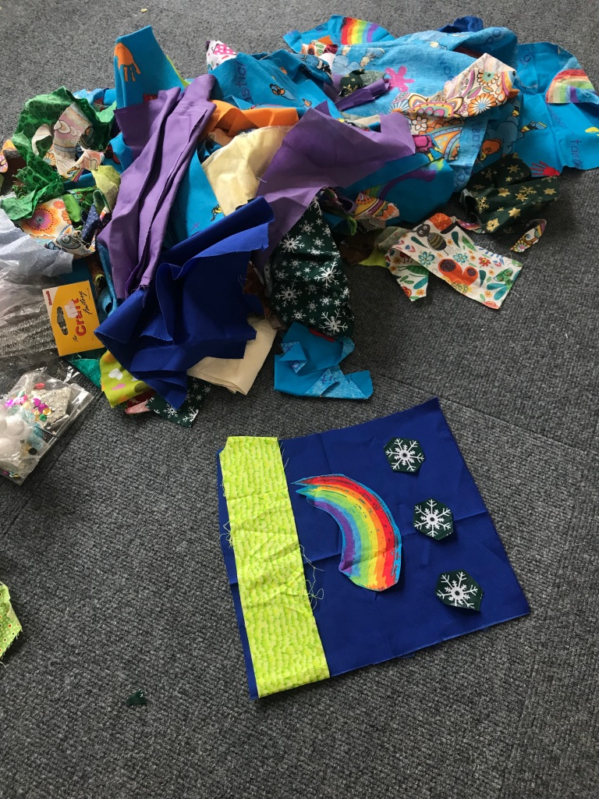
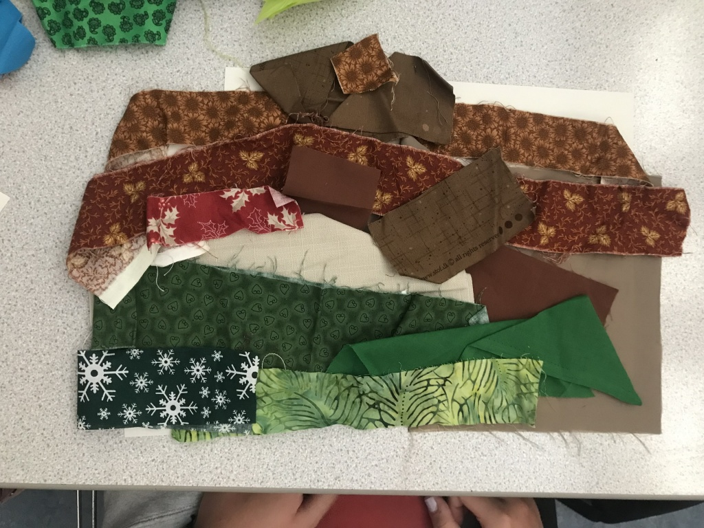
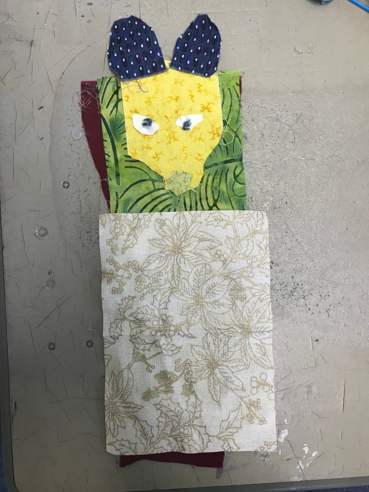
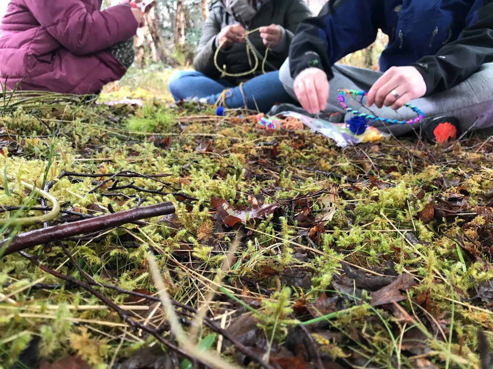
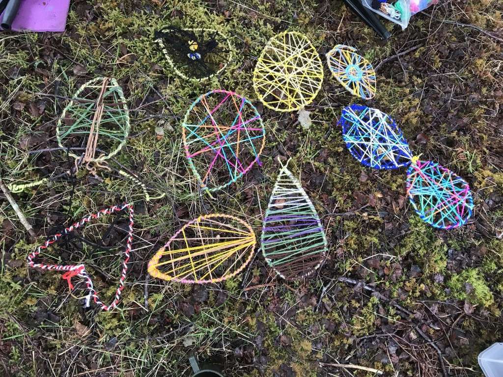
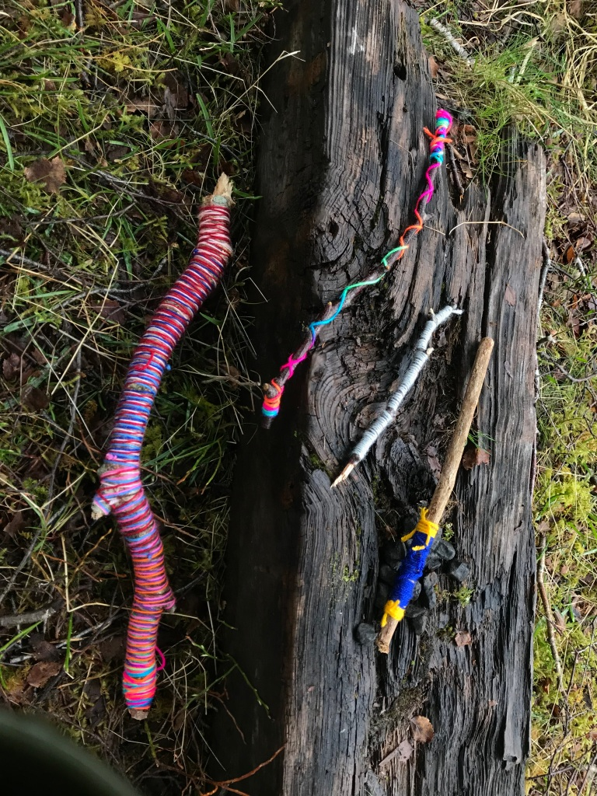
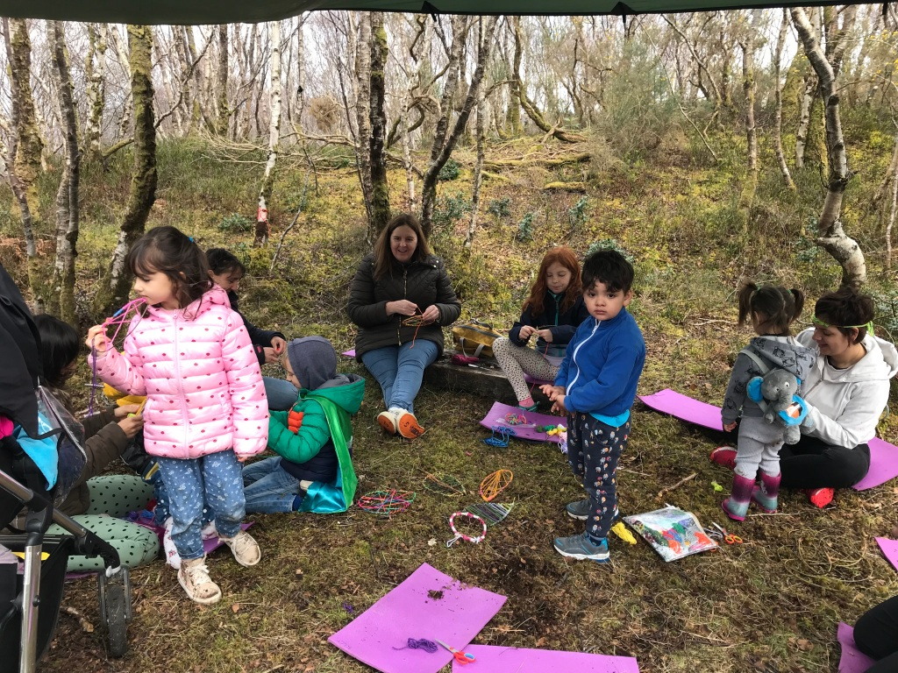
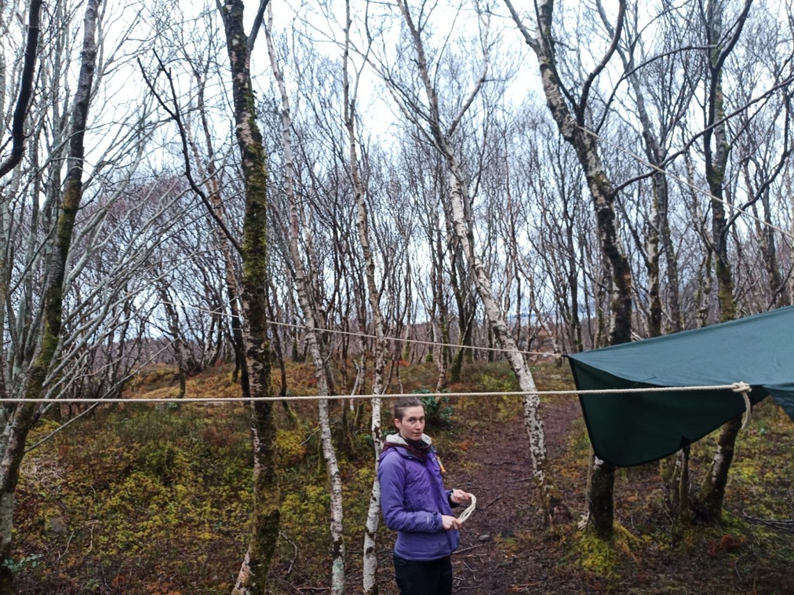
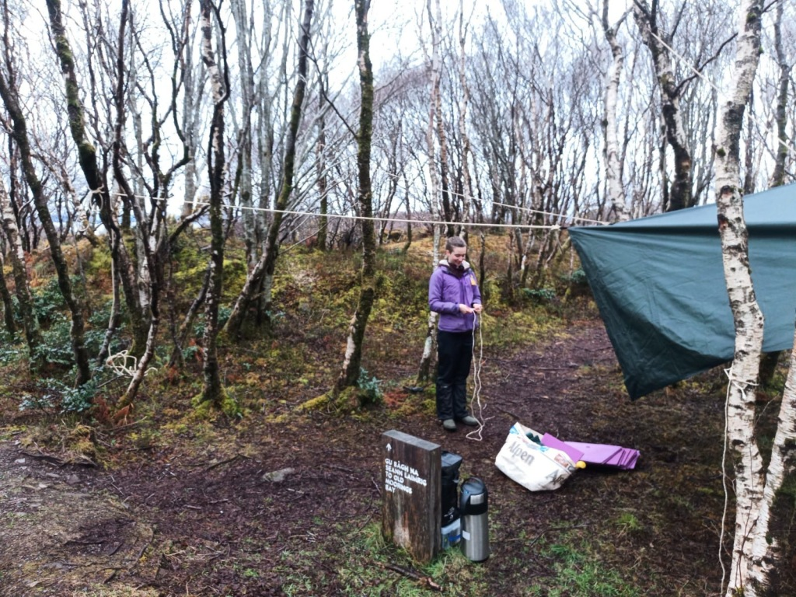

This month, like all the other months, I did many different creative activities; a few of which I will share with you…

In the primary schools we carried on making fabric creations for the Scottish Creations exhibition. They mad some beautiful landscapes and creatures some even turned into puppets! I also went into Plockton High School and some of the pupils made fabric landscapes too.

In the Easter holidays, I decided to do some free craft activities open to anyone at the Plock of Kyle, my local parkland. We used willow and wool to make different craft items, check the images below for what we did each day!

One of the women who came along said: “It was a great space to connect with people and do some crafts in the fresh air.”

As you can see from these low-quality photos of me in the purple jacket, the tarp was tricky to put up in a way that puddles wouldn’t gather, but it was rewarding when we got it sorted.

