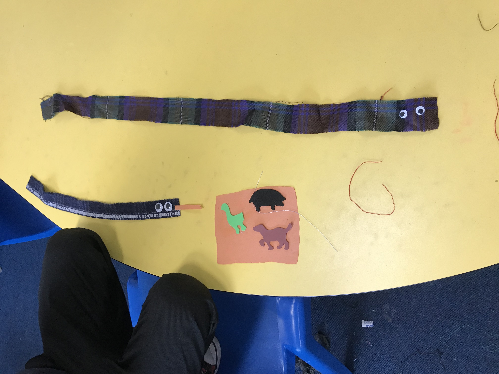
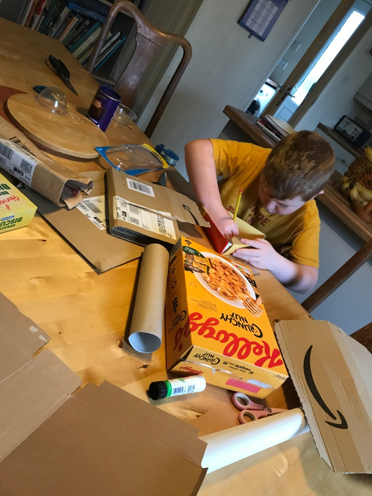
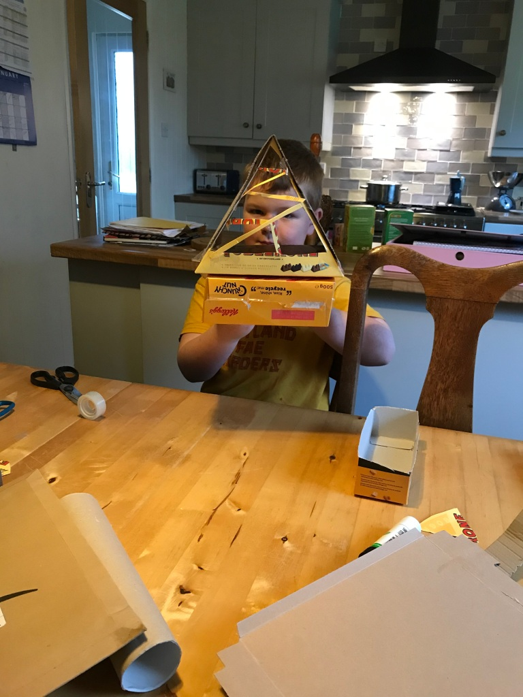
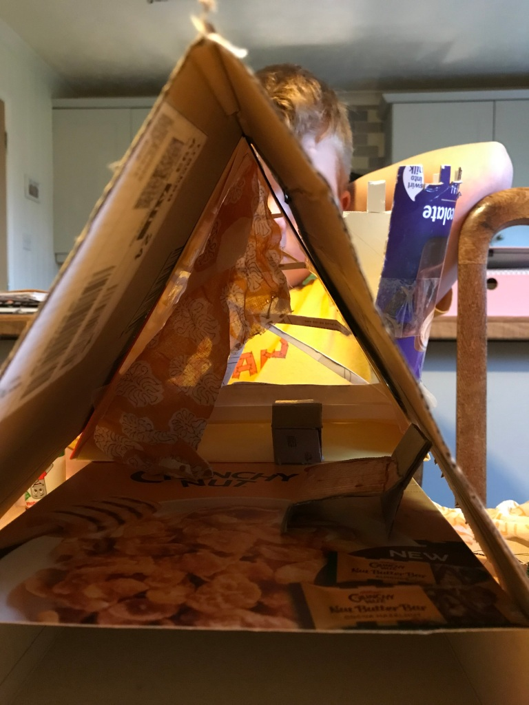
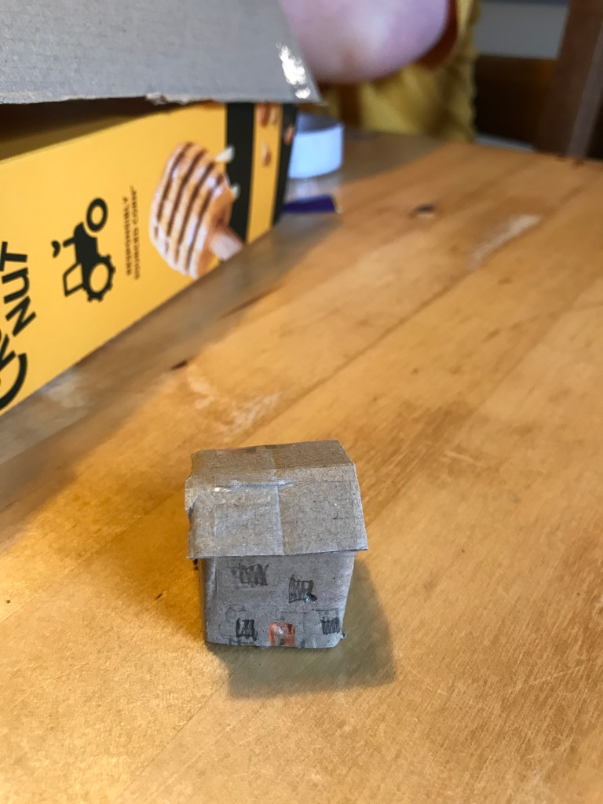

This month my project leader, Ruari Gordon contacted me about a touring exhibition called Scottish Creations that would be happening in Dunvegan hall on Skye in May 2022. Kelly Donaldson from Creative Lives was organising the exhibition and she asked if I’d like to make some art with the children that they could exhibit, so of course I said “yes!"

So, at Auchtertyre we started making fabric creations for the exhibition. I suggested that we make anything inspired by our local ecosystem: the creatures and the landscape… The children were so excited to have a bag of colourful fabric scraps to dig into! The fabric was kindly donated by Jackie Sheddan who was my teacher when I went to Loch Duich Primary all those years ago. We got the googly eyes out and the children started experimenting! 

I also made miniature houses with one of the homeschooled boys as an introduction to making set design miniatures.

