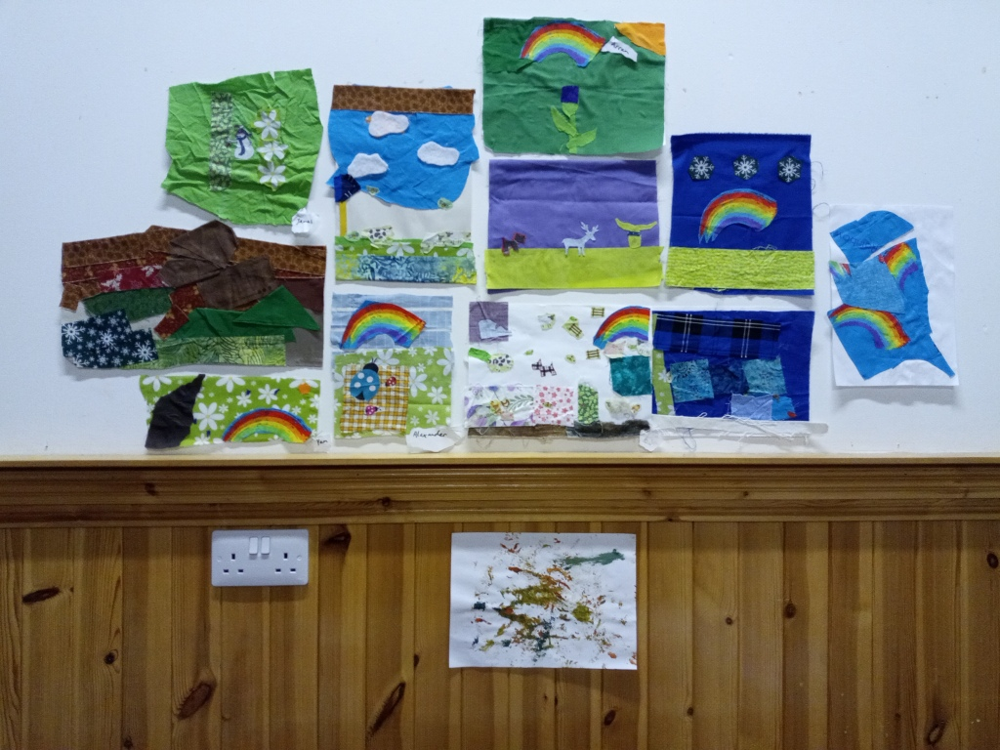
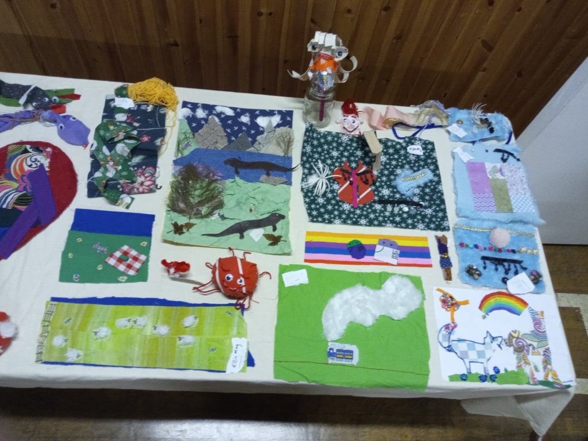
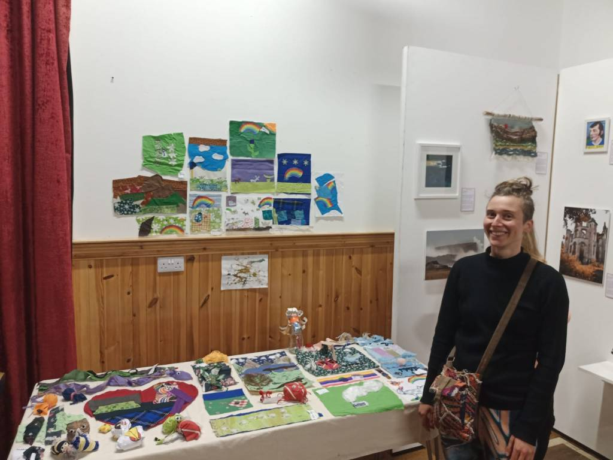

This month we kept working away making our fabric landscapes and creatures, getting ready for the Scottish Creations exhibition on 23rd May! Some of the children were nervous about having their creation in an “exhibition”, so I told them that it’s more of an opportunity to show people what they’ve been making, rather than having finished pieces (art is never truly finished anyway). I also reassured them that they would get their art back afterwards and then they felt more confident about having their work shown.

Here are the pictures of the exhibition!

I was interviewed about the children's artwork by Daysix and I think they did a beautiful job of showing the exhibition and the surrounding landscape! Check it out below:

https://www.youtube.com/watch?v=dVAezLzfCLw&ab\_channel=ScottishEnsemble

More information here: https://scottishensemble.co.uk/sounds-and-stories/stories-from-scottish-creations-skye/
