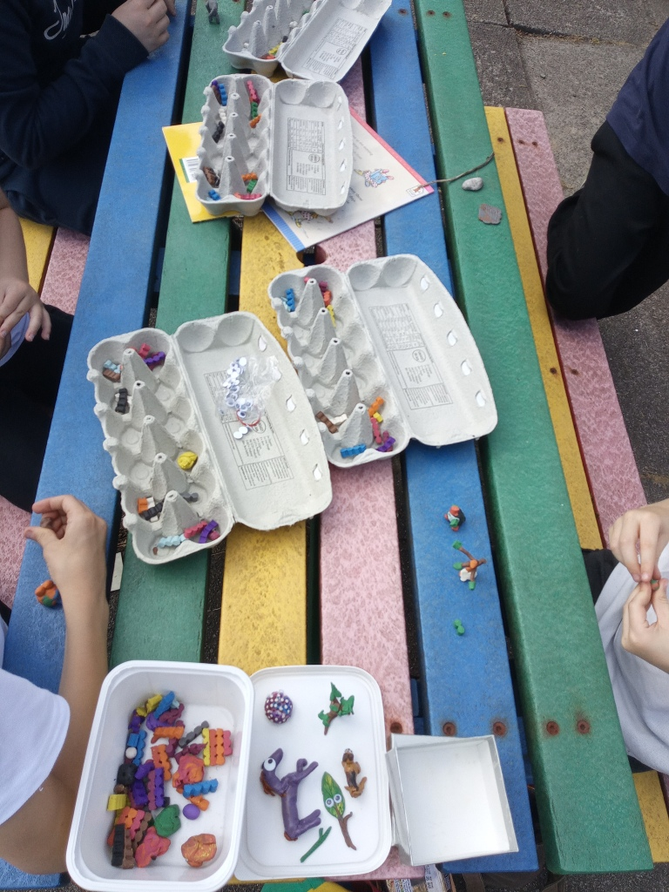
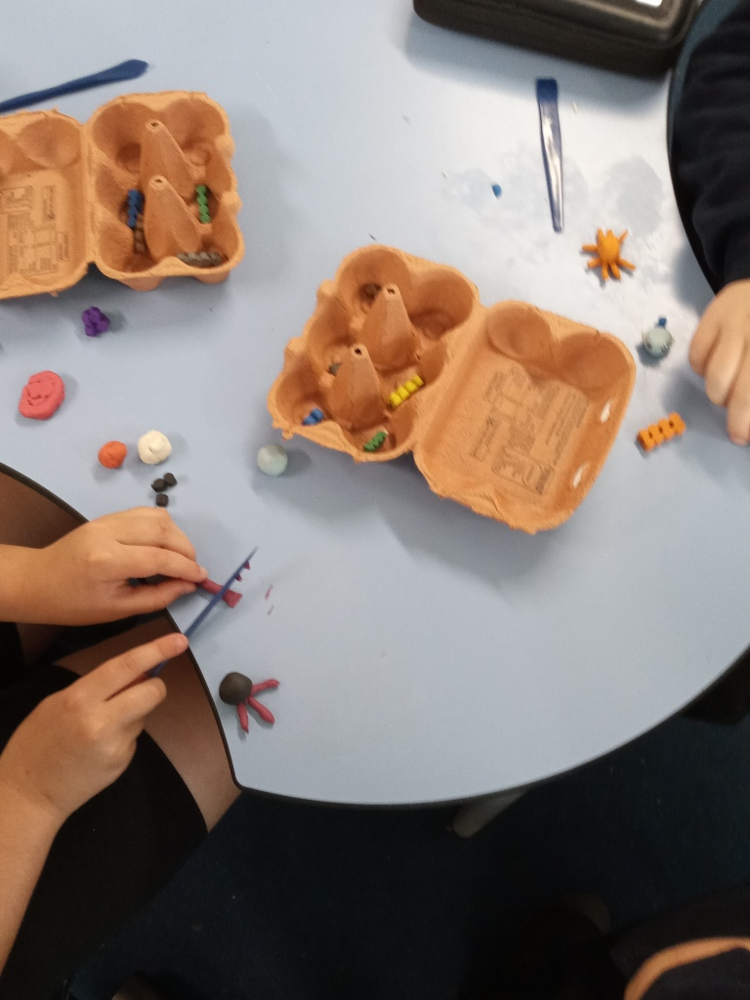
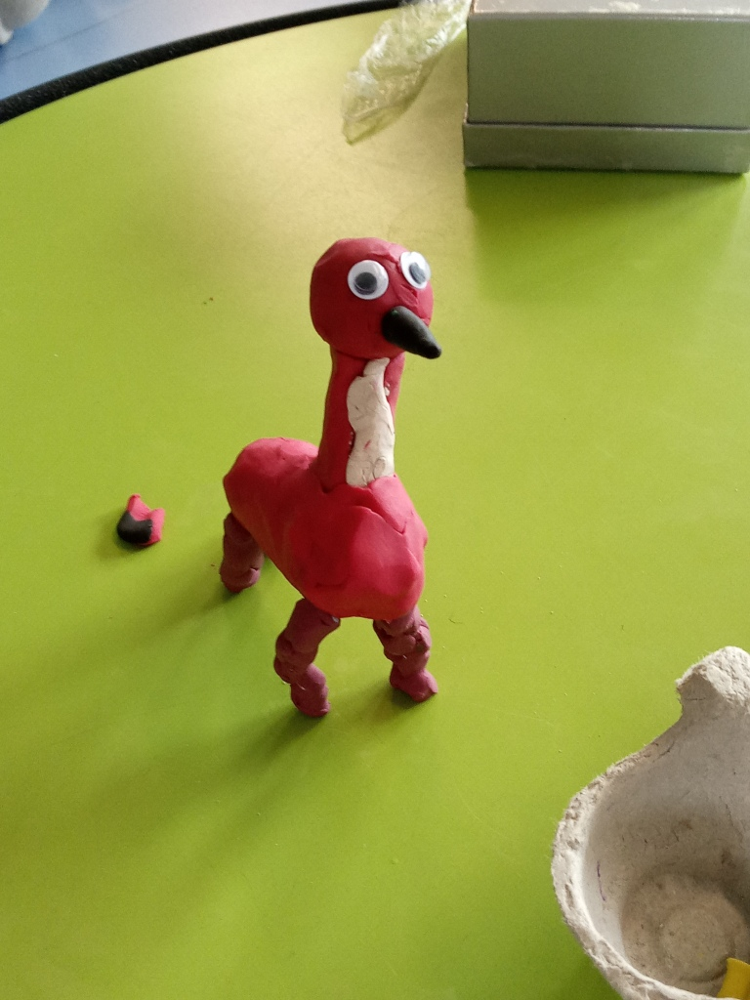
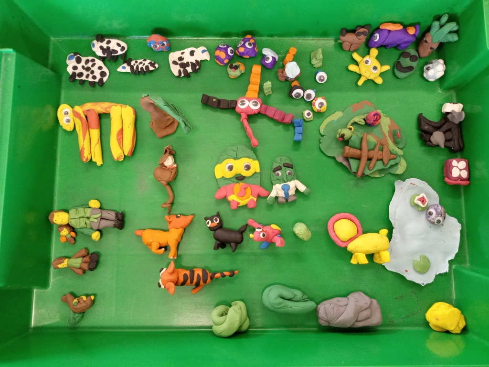
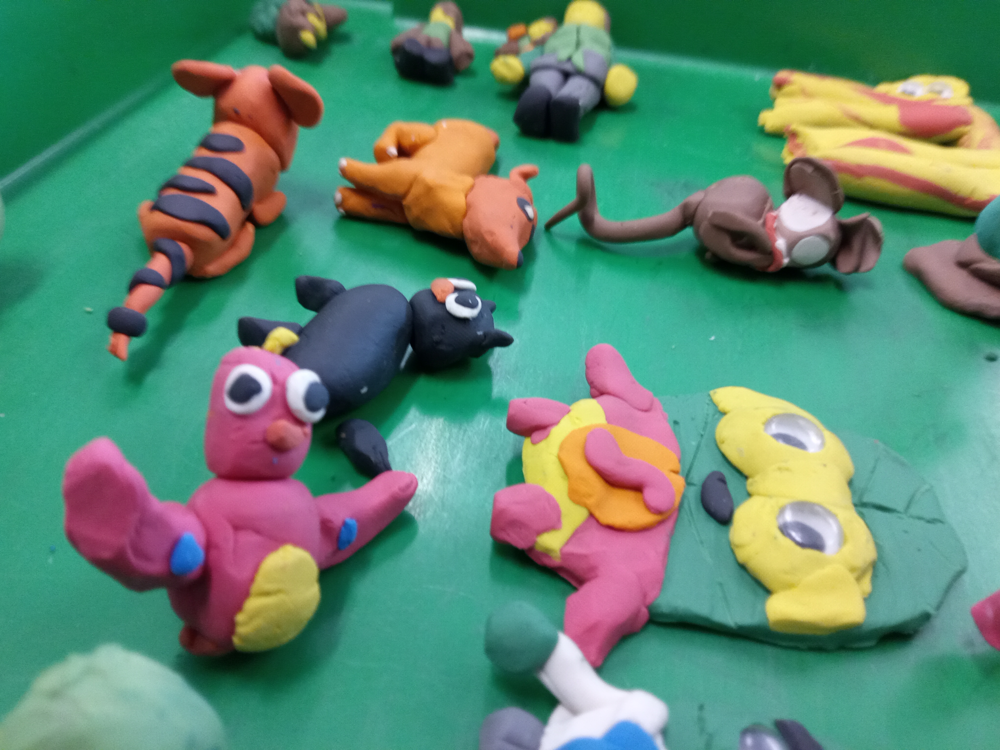
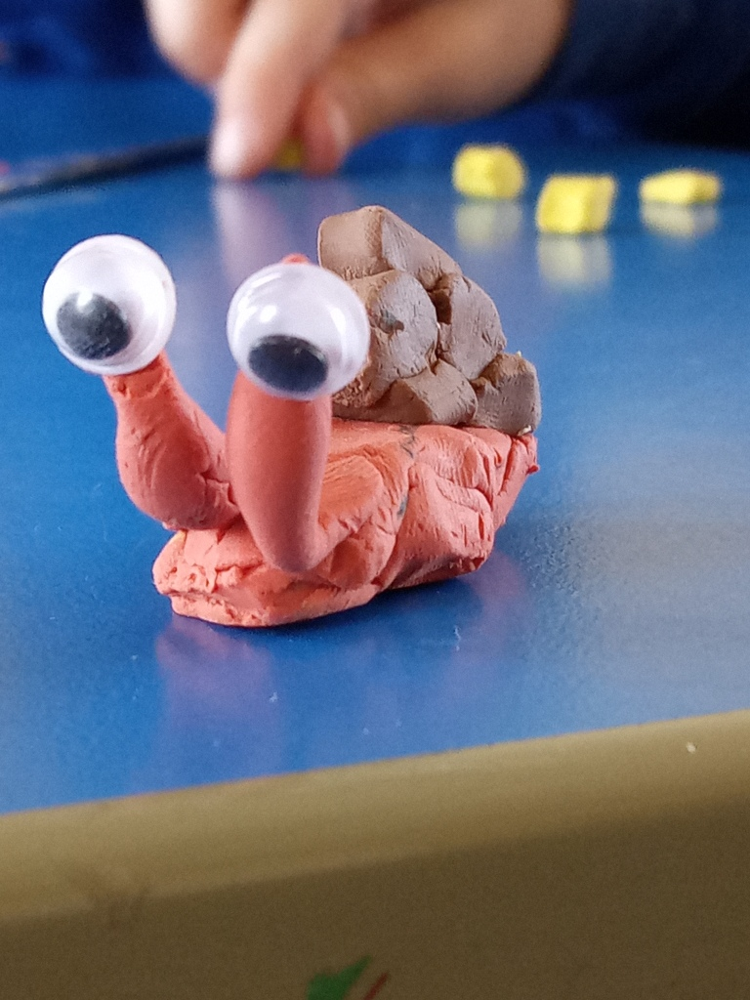

After seeing some of the children at Kyle Primary making a stop motion animation earlier in the year, I decided that it would be a great thing to try with them all! So, I began by ordering 20kg of different coloured plasticine bars and I put a few pieces of each colour in an assortment of egg boxes. I went into the schools, egg boxes piled high, and said to the children: “We’re going to make stop motion animations! But first, we need to make some characters to animate with!” I invited them to take inspiration for the natural world, they could make plants or animals or anything from nature. They had so much fun and their creations were beautiful!

There’s an app called Stop Motion Studio that you can download on your phone and easily make animations. So the teachers split their classes into small groups so that each group could start thinking about storylines and ideas of what their animation might look like. I then took each group one at a time into the playground to make their animation with a natural backdrop. There were always giggles about something; lots of fun!

