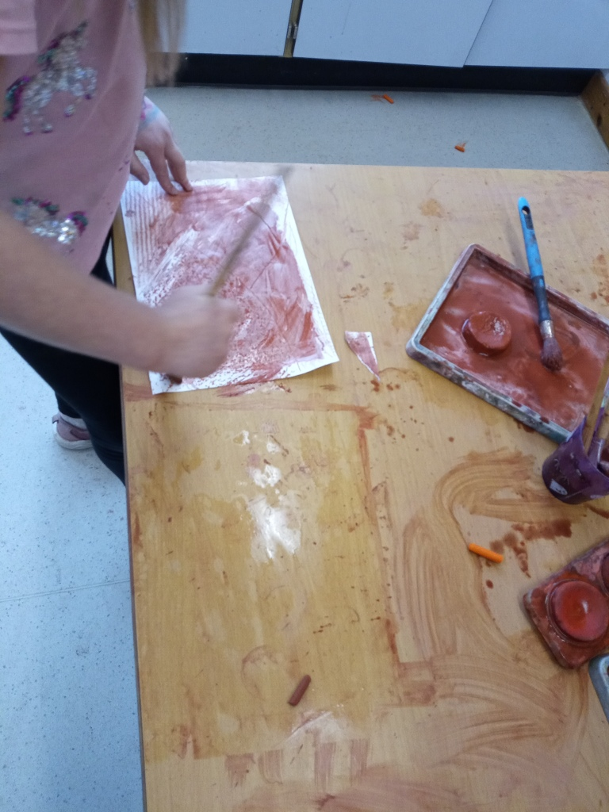
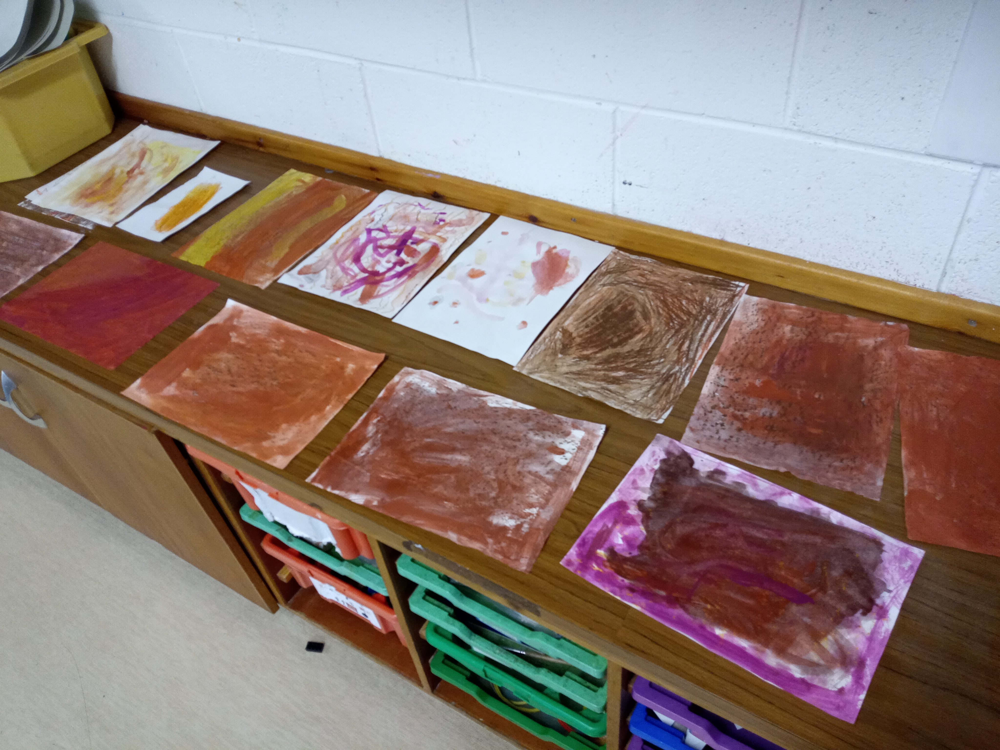
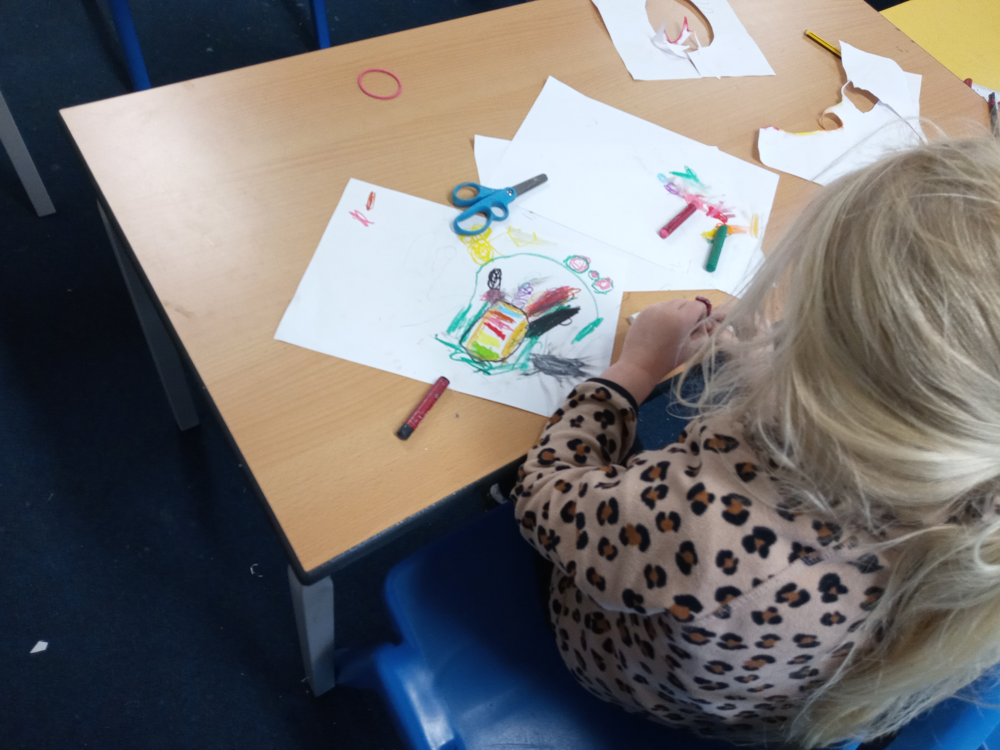
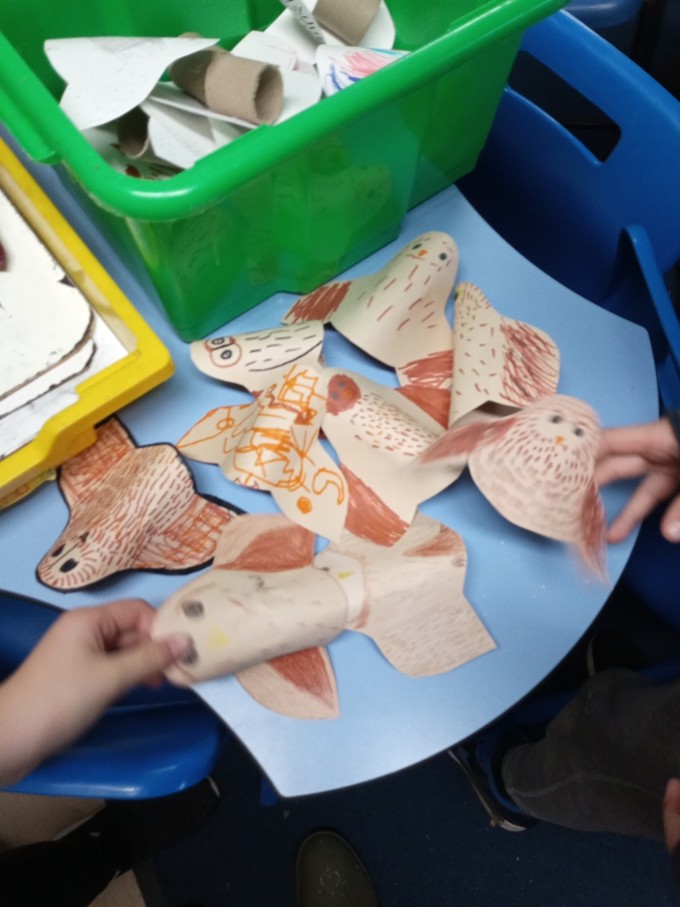
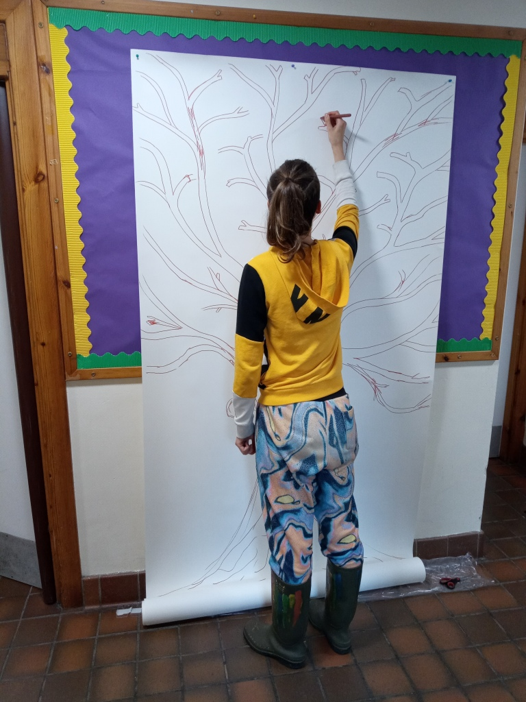
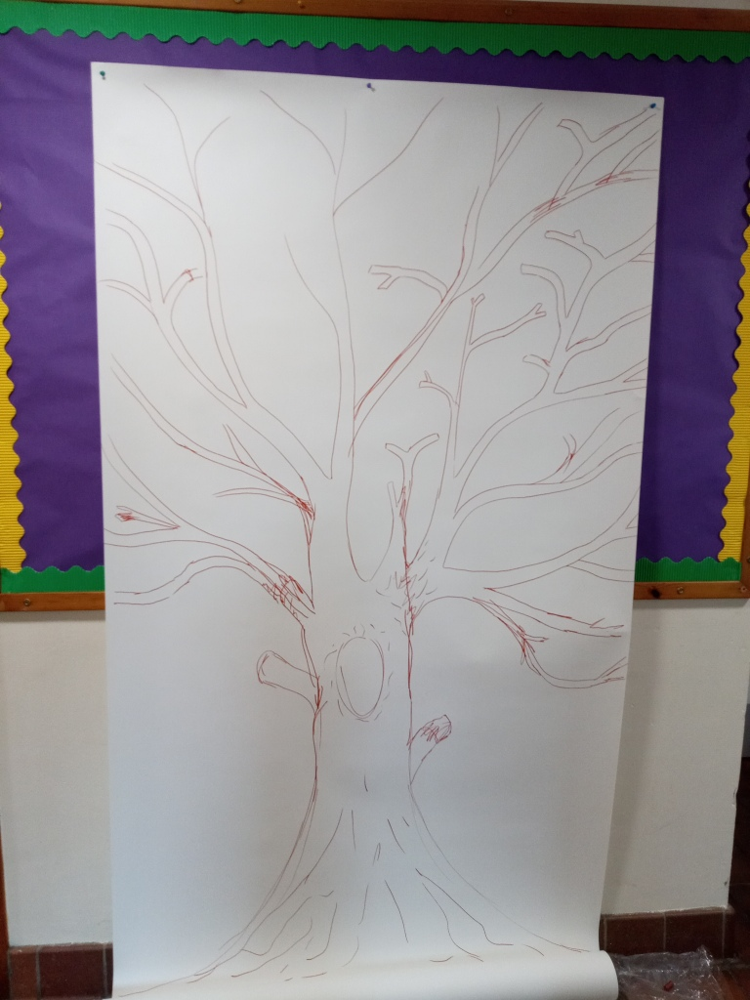
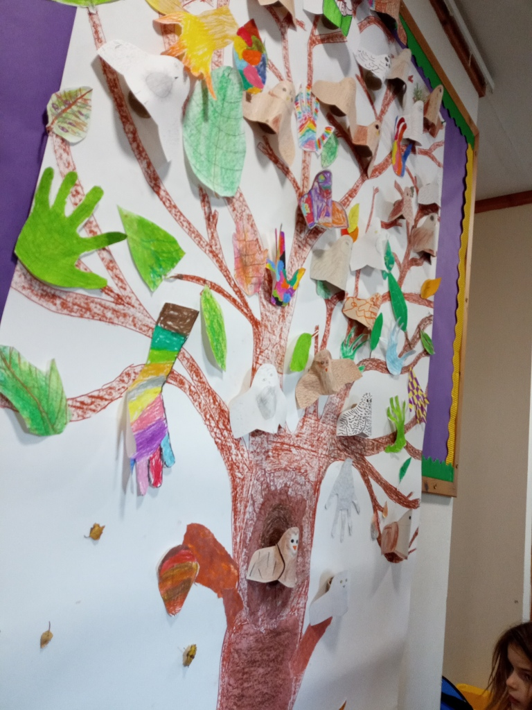
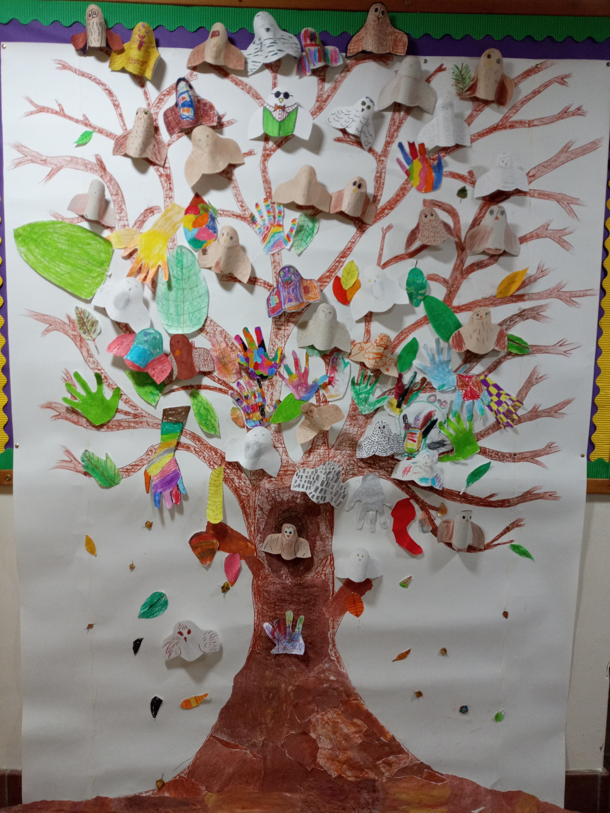

This month I continued making stop motion animations with the primary schools. Above is an image of one child's plasticine crocodile; so cute! And very well made.

The head teacher at one of the primary schools wanted to brighten up their corridor by creating a collaborative artwork to give the children a sense of belonging. So she suggested we all make an owl tree together! Each of the children are allocated to one of three houses: Tawny Owl, Barn Owl and Snowy Owl. So they each made a paper owl to show which house they belong to.

